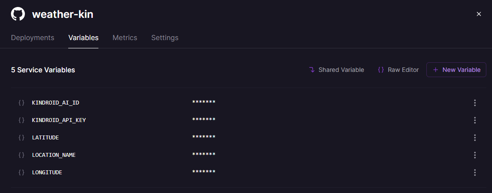

# weather-kin

Automatically updates a [Kindroid](https://kindroid.ai/) AI's **Current Setting** with live weather, so your kin always knows what it's like outside.

Supports two weather providers:
- [Open-Meteo](https://open-meteo.com/) — a free weather API that requires no account and no API key (default)
- [Visual Crossing](https://www.visualcrossing.com/) — a weather API with a free tier (requires a free account and API key)

### Example

> It's currently 12°C and rainy outside, with strong winds.

> It's currently 8°C here in Seabreak, British Columbia. Fog is rolling in.

> Today's weather forecast for Seabreak, British Columbia: a high of 14°C and a low of 5°C, rainy. It's expected to be windy.

---

## What you'll need

- A [Kindroid](https://kindroid.ai/) account
- Your **Kindroid API key** (found at the bottom of the general settings tab in Kindroid app)
- Your **kin's AI ID** (found just below the API key)
- A free [GitHub](https://github.com/) account
- A free [Railway](https://railway.com/) account

---

## Step 1: Fork the repo

1. Go to the [weather-kin GitHub repo](https://github.com/Obiiiiiiiiii/weather-kin).
2. Click the **Fork** button in the top right.
3. This creates your own copy of the code on GitHub.

---

## Step 2: Find your Kindroid API key and AI ID

1. Open the **Kindroid app** and go to **General** tab.
2. Scroll down to the very bottom to find your **API key** — copy it somewhere safe.
3. Copy your Kin's **AI ID**.

> You'll paste both of these into Railway in the next step.

---

## Step 3: Find your location's coordinates

1. Go to [Google Maps](https://maps.google.com/) and search for your kin's location.
2. Right-click the map and click the **coordinates** that appear (this copies them).
3. You'll get something like `49.16, -123.94` — the first number is **latitude**, the second is **longitude**.

---

## Step 4: Deploy on Railway

1. Go to [railway.com](https://railway.com/) and sign in (or create a free account).
2. Click **New Project** → **Deploy from GitHub repo**.
3. Select your forked **weather-kin** repository.
4. Railway will detect the project automatically. Before it deploys, you need to add your environment variables.

### Add environment variables

Go to your service's **Variables** tab and add the following:

| Variable | Example | Description |
|---|---|---|
| `KINDROID_API_KEY` | `your-api-key` | Your Kindroid API key |
| `KINDROID_AI_ID` | `your-ai-id` | Your kin's AI ID |
| `LATITUDE` | `49.16` | Your location's latitude |
| `LONGITUDE` | `-123.94` | Your location's longitude |
| `TZ` | `America/Vancouver` | Your timezone ([list of timezones](https://en.wikipedia.org/wiki/List_of_tz_database_time_zones)) |

**Optional** — these have sensible defaults, but you can override them:

| Variable | Default | Description |
|---|---|---|
| `WEATHER_PROVIDER` | `openmeteo` | `openmeteo` or `visualcrossing` |
| `VISUALCROSSING_API_KEY` | *(none)* | Your Visual Crossing API key (required when using `visualcrossing` provider) |
| `LOCATION_NAME` | *(none)* | Location name shown in the scene (e.g. `Seabreak`) |
| `LOCATION_REGION` | *(none)* | Region/state for seasonal context (e.g. `British Columbia`) |
| `TEMPERATURE_UNIT` | `celsius` | `celsius` or `fahrenheit` |
| `WIND_SPEED_UNIT` | `kmh` | `kmh` or `mph` |
| `UPDATE_HOURS` | `0,6,12,18` | Comma-separated hours (0–23) to update weather |
| `FORECAST_HOUR` | *(none)* | Hour (0–23) to send a daily forecast instead of current conditions |

Here's what it looks like on Railway:



---

## Step 5: Deploy

1. Once your variables are saved, click **Deploy** (or Railway may deploy automatically).
2. Check the **Logs** tab — you should see something like:

   ```
   Update schedule: 0:00, 6:00, 12:00, 18:00
   [2026-03-18T06:00:00.000Z] Fetching weather...
   [2026-03-18T06:00:01.234Z] Scene: "It's currently 12°C and rainy in Seabreak."
   [2026-03-18T06:00:01.567Z] Kindroid updated.
   Next update at 12:00 PM (in 360 min)
   ```

3. That's it! Your kin's Current Setting will now update with live weather at the hours you configured.

---

## Customization tips

- **Want updates every 3 hours?** Set `UPDATE_HOURS` to `0,3,6,9,12,15,18,21`.
- **Want just morning and evening?** Set `UPDATE_HOURS` to `8,20`.
- **Using Fahrenheit and mph?** Set `TEMPERATURE_UNIT=fahrenheit` and `WIND_SPEED_UNIT=mph`.
- **Want a morning forecast?** Set `FORECAST_HOUR=7` to get the day's high, low, and conditions at 7am. All other update hours still give current conditions.
- **Want to use Visual Crossing?** Set `WEATHER_PROVIDER=visualcrossing` and add your `VISUALCROSSING_API_KEY`. Get a free key at [visualcrossing.com](https://www.visualcrossing.com/).

---

## How it works

1. Fetches current weather from your configured provider (Open-Meteo or Visual Crossing) for your coordinates.
2. Converts the weather data into a natural-language sentence (temperature, conditions, wind).
3. If `FORECAST_HOUR` is set and it's that hour, sends a daily forecast (high, low, conditions, wind) instead.
4. Pushes the scene to your kin's Current Setting via the Kindroid API.
5. Waits until the next scheduled hour and repeats.

If a fetch fails, the last successful scene is kept until the next successful update.

### Weather providers

**Open-Meteo** (default) is completely free with no API key required. It uses WMO weather codes directly.

**Visual Crossing** requires a free account and API key from [visualcrossing.com](https://www.visualcrossing.com/). To use it, set `WEATHER_PROVIDER=visualcrossing` and provide your key in `VISUALCROSSING_API_KEY`. Visual Crossing's icon-based conditions are mapped to WMO codes internally, so the output format is the same regardless of provider. Note that Visual Crossing uses peak wind gust (rather than mean wind speed) for daily forecasts to better match Open-Meteo's behavior.

**Note:** Location name and region are optional. If set, they appear in the scene (e.g. *"here in Seabreak, British Columbia"*). If not, current conditions say *"outside"* and forecasts just say *"Today's forecast:"* — useful if the location is already in your kin's backstory.

---

## License

MIT
